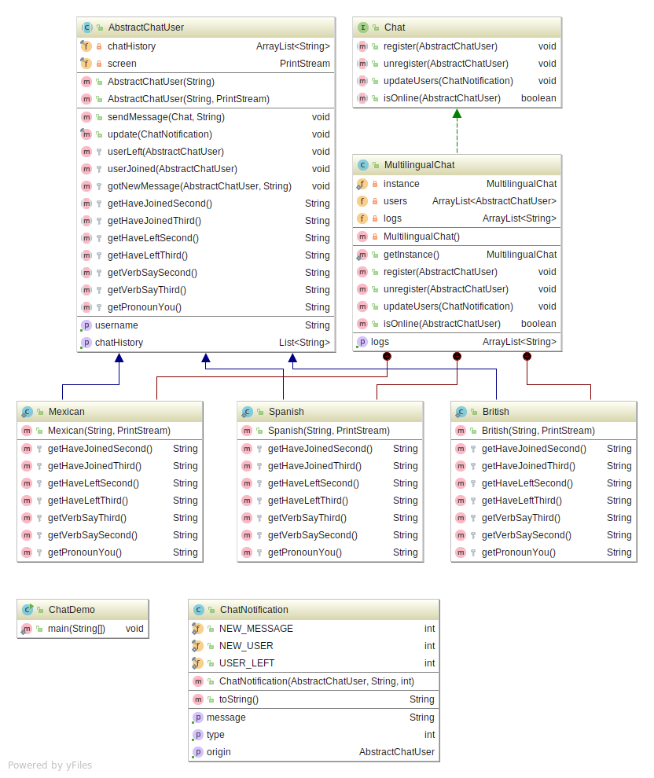

# Simple Mock-up chat app that uses the Template and Observer design patterns

## Background

This mock-up/application is based on the following specification:

> You’ve been asked to create a chat app that’ll have users from three
> different countries: Spain, Mexico and the UK. All users have a name
> to identify themselves with (for simplicity, suppose they all use
> different names and won’t try to use a name that’s already been
> taken). Every time a new user joins the chat all other members are
> notified with a message that corresponds to their country of origin a
> spanish member, for example, will receive something like “Habéis
> conseguido un nuevo compañero”, a mexican member will receive a
> different message that is more suited for their region and a british
> member will receive a message in English. All users will be notified
> when one of them sends a message, and everyone will be able to read
> it. Lastly, if a user leaves the chat, the remaining users will be
> notified.

It was developed as part of the activities of the 2018 Modeling and
Programming course taught by Prof. Rosa Victoria Villa Padilla at the
[Science Faculty](http://www.fciencias.unam.mx/) of the [National
Autonomous University of Mexico](https://www.unam.mx/).

### Observer pattern

According to Freeman and Sierra’s [book on design
patterns](https://g.co/kgs/ycnzMg):

> The Observer Pattern defines a one-to-many dependency between objects
> so that when one object changes state, all of its dependents are
> notified and updated automatically.

### Template pattern

According to Freeman and Sierra’s [book on design
patterns](https://g.co/kgs/ycnzMg):

> The Template Method Pattern defines the skeleton of an algorithm in a
> method, deferring some steps to subclasses. Template Method lets
> subclasses redefine certain steps of an algorithm without changing the
> algorithm’s structure.

## Design

The following design patterns were used:

  - Singleton for the main chat instance.
  - Template so users could display notifications in their language.
  - Observer so users would be updated whenever the chat received an
    update.

Moreover, this app uses an MVC-like architectural pattern:

    controllers/
        ChatDemo.java
    models/
        AbstractChatUser.java
        Chat.java
        ChatNotification.java
    services/
        MultilingualChat.java

this increments encapsulation, and clarifies its structure.

## Implementation

As depicted above, chat users combine the observer and template design
patterns. The result is an abstract class that provides an update method
that is preserves certain algorithmic isomorphism throughout its
subclasses which, via the abstract methods, should be able to correctly
display all sorts of chat notifications.

### Use of the observer pattern

In this application, the `MultilingualChat` class (which implements
Chat) and its inner user subclasses complete the Subject-Observer
duality. The chat has a list of users which are notified every time the
chat receives an update via a `ChatNotification`.

### Use of the template pattern

In this application, the `AbstractChatUser` class provides the template
method `update` which utilizes this class’ abstract methods in order to
accomplish homogeneous behavior across its subclasses provided they have
implemented them correctly.

## Building and running the program

The program can be built using gradle, the most common tasks are
described bellow, for a full list of available tasks use `./gradlew
tasks`. If you’re on Linux or Mac then running the following command
from the project’s main directory will be enough to build and run the
program: `./gradlew run`. If you’re on windows use `gradlew.bat run`
from the command prompt instead.

Some of the most common tasks are:

1.  `./gradlew build`, compiles and creates the outputs of this project.
2.  `./gradlew javadoc`, generates the program’s documentation and puts
    it inside `build/docs/javadoc`.
3.  `./gradlew run`, builds the program and runs the application.
4.  `./gradlew clean`, deletes all files and folders generated during
    the build process (except the .gradle directory).

## Acknowledgements

For more information on the tools used to build, create and run this
program refer to the following links:

  - [Pandoc](https://pandoc.org/) is a Haskell library for converting
    from one markup format to another, and a command-line tool that uses
    this library. Pandoc was used to keep this README file consistent.
  - [Gradle](https://gradle.org/) was used to create the build script.
  - [JetBrains’ IntelliJ IDEA](https://www.jetbrains.com/idea/) was used
    as the primary editor. Its diagramming utility also came in handy to
    produce the application’s class diagram.
